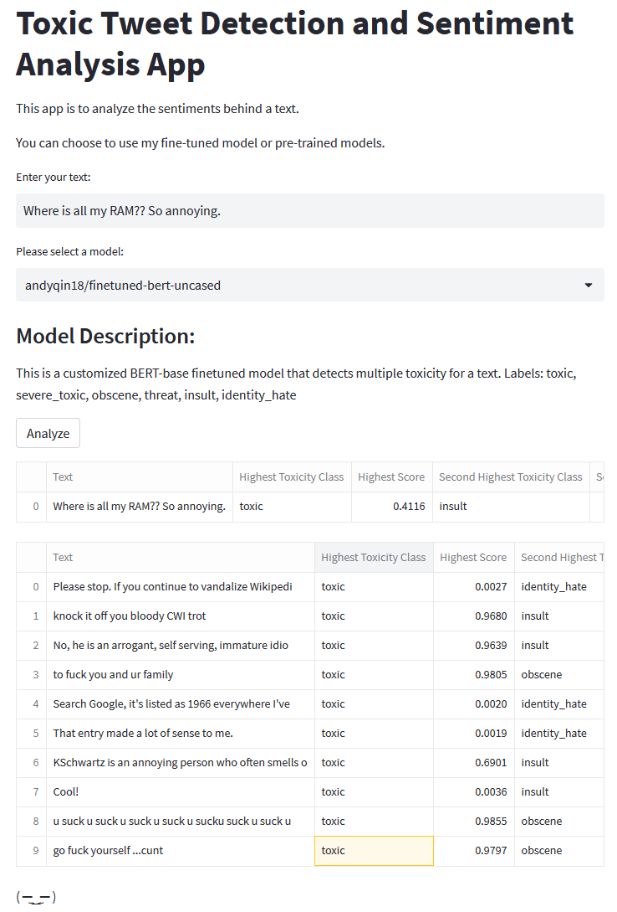

# AI Project: Finetuning Language Models - Toxic Tweets

Hello! This is a project for CS-UY 4613: Artificial Intelligence. I'm providing a step-by-step instruction on finetuning language models for detecting toxic tweets.

# Milestone 3

This milestone includes finetuning a language model in HuggingFace for sentiment analysis.

Link to app: https://huggingface.co/spaces/andyqin18/sentiment-analysis-app

Here's the setup block:
```
import pandas as pd
import numpy as np
import torch
from sklearn.model_selection import train_test_split
from torch.utils.data import Dataset
from transformers import AutoTokenizer, AutoModelForSequenceClassification, TrainingArguments, Trainer
device = torch.device('cuda') if torch.cuda.is_available() else torch.device('cpu')
```

## 1. Prepare Data
First we extract comment strings and labels from `train.csv` and split them into training data and validation data with a percentage of 80% vs 20%. We also create 2 dictionaries that map labels to integers and back.
```
df = pd.read_csv("milestone3/comp/train.csv")

train_texts = df["comment_text"].values
labels = df.columns[2:]
id2label = {idx:label for idx, label in enumerate(labels)}
label2id = {label:idx for idx, label in enumerate(labels)}
train_labels = df[labels].values


# Randomly select 20000 samples within the data
np.random.seed(18)
small_train_texts = np.random.choice(train_texts, size=20000, replace=False)

np.random.seed(18)
small_train_labels_idx = np.random.choice(train_labels.shape[0], size=20000, replace=False)
small_train_labels = train_labels[small_train_labels_idx, :]


# Separate training data and validation data
train_texts, val_texts, train_labels, val_labels = train_test_split(small_train_texts, small_train_labels, test_size=.2)
```

## 2. Data Preprocessing
As models like BERT don't expect text as direct input, but rather `input_ids`, etc., we tokenize the text using the tokenizer. The `AutoTokenizer` will automatically load the appropriate tokenizer based on the checkpoint on the hub. We can now merge the labels and texts to datasets as a class we defined.
```
tokenizer = AutoTokenizer.from_pretrained("bert-base-uncased")

class TextDataset(Dataset):
  def __init__(self,texts,labels):
    self.texts = texts
    self.labels = labels

  def __getitem__(self,idx):
    encodings = tokenizer(self.texts[idx], truncation=True, padding="max_length")
    item = {key: torch.tensor(val) for key, val in encodings.items()}
    item['labels'] = torch.tensor(self.labels[idx],dtype=torch.float32)
    del encodings
    return item

  def __len__(self):
    return len(self.labels)


train_dataset = TextDataset(train_texts, train_labels)
val_dataset = TextDataset(val_texts, val_labels)
```

## 3. Train the model using Trainer
We define a model that includes a pre-trained base and also set the problem to `multi_label_classification`. Then we train the model using `Trainer`, which requires  `TrainingArguments` beforehand that specify training hyperparameters, where we can set learning rate, batch sizes and `push_to_hub=True`.

After verifying Token with HuggingFace, the model is now pushed to the hub.

```
model = AutoModelForSequenceClassification.from_pretrained("bert-base-uncased", 
                                                           problem_type="multi_label_classification", 
                                                           num_labels=len(labels),
                                                           id2label=id2label,
                                                           label2id=label2id)
model.to(device)

training_args = TrainingArguments(
    output_dir="finetuned-bert-uncased",
    evaluation_strategy = "epoch",
    save_strategy = "epoch",
    learning_rate=2e-5,
    per_device_train_batch_size=16,
    per_device_eval_batch_size=16,
    num_train_epochs=5,
    load_best_model_at_end=True,
    push_to_hub=True
)

trainer = Trainer(
    model=model,
    args=training_args,
    train_dataset=train_dataset,
    eval_dataset=val_dataset,
    tokenizer=tokenizer
)

trainer.train()
trainer.push_to_hub()
```

## 4. Update the app

Modify [app.py](app.py) so that it takes in one text and generate an analysis using one of the provided models. Details are explained in comment lines. The app should look like this:

