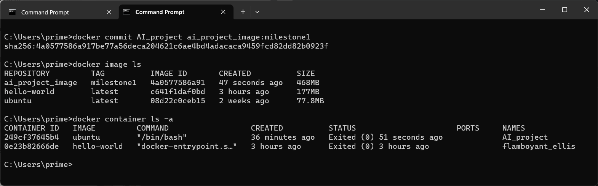

# AI Project: Finetuning Language Models - Toxic Tweets

Hello! This is a project for CS-UY 4613: Artificial Intelligence. I'm providing a step-by-step instruction on finetuning language models for detecting toxic tweets.

# Milestone 1

This milestone includes setting up docker and creating a development environment on Windows 11.

## 1. Enable WSL2 feature

The Windows Subsystem for Linux (WSL) lets developers install a Linux distribution on Windows.

```
wsl --install 
```

Ubuntu is the default distribution installed and WSL2 is the default version. 
After creating linux username and password, Ubuntu can be seen in Windows Terminal now.
Details can be found [here](https://learn.microsoft.com/en-us/windows/wsl/install).


## 2. Download and install the Linux kernel update package

The package needs to be downloaded before installing Docker Desktop. 
However, this error might occur:

`Error: wsl_update_x64.msi unable to run because "This update only applies to machines with the Windows Subsystem for Linux"`

Solution: Opened Windows features and enabled "Windows Subsystem for Linux". 
Successfully ran update [package](https://docs.microsoft.com/windows/wsl/wsl2-kernel).


## 3. Download Docker Desktop

After downloading the [Docker App](https://www.docker.com/products/docker-desktop/), WSL2 based engine is automatically enabled. 
If not, follow [this link](https://docs.docker.com/desktop/windows/wsl/) for steps to turn on WSL2 backend. 
Open the app and input `docker version` in Terminal to check server running.


Docker is ready to go.

## 4. Create project container and image

First we download the Ubuntu image from Docker’s library with:
```
docker pull ubuntu
```
We can check the available images with:
```
docker image ls
```
We can create a container named *AI_project* based on Ubuntu image with:
```
docker run -it --name=AI_project ubuntu
```
The `–it` options instruct the container to launch in interactive mode and enable a Terminal typing interface. 
After this, a shell is generated and we are directed to Linux Terminal within the container.
`root` represents the currently logged-in user with highest privileges, and `249cf37645b4` is the container ID.


## 5. Hello World!

Now we can mess with the container by downloading python and pip needed for the project. 
First we update and upgrade packages by: (`apt` is Advanced Packaging Tool)
```
apt update && apt upgrade
```
Then we download python and pip with:
```
apt install python3 pip
```
We can confirm successful installation by checking the current version of python and pip.
Then create a script file of *hello_world.py* under `root` directory, and run the script.
You will see the following in VSCode and Terminal.


## 6. Commit changes to a new image specifically for the project

After setting up the container we can commit changes to a specific project image with a tag of *milestone1* with:
```
docker commit [CONTAINER] [NEW_IMAGE]:[TAG]
```
Now if we check the available images there should be a new image for the project. If we list all containers we should be able to identify the one we were working on through container ID.



The Docker Desktop app should match the image list we see on Terminal.


